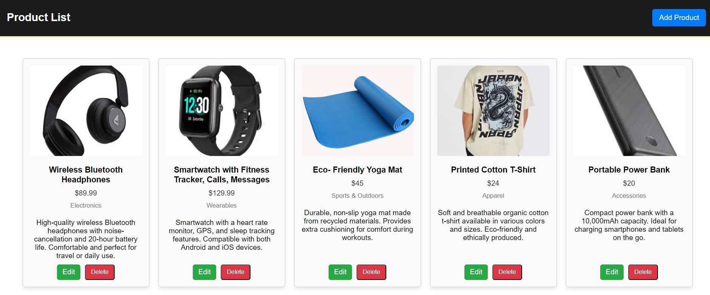
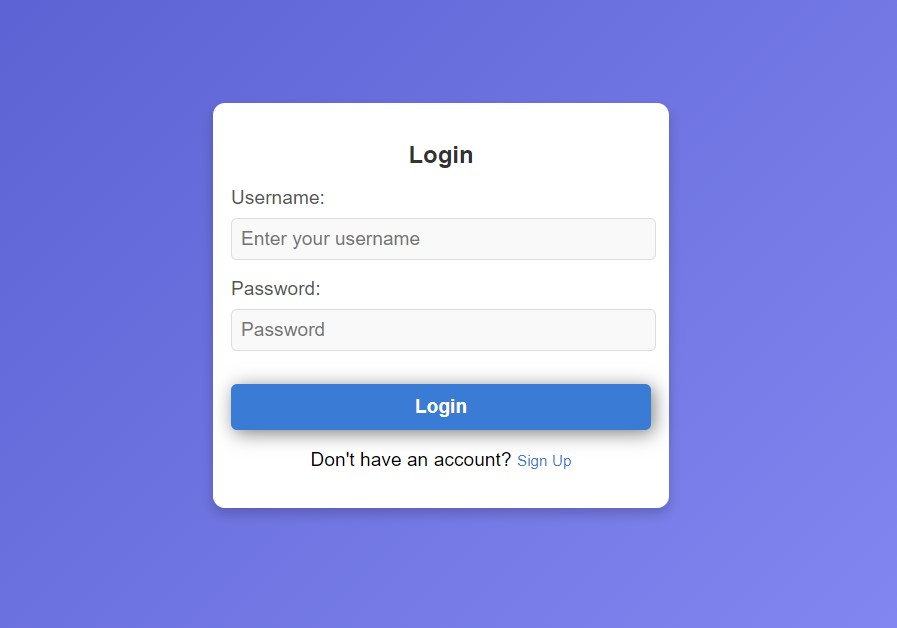
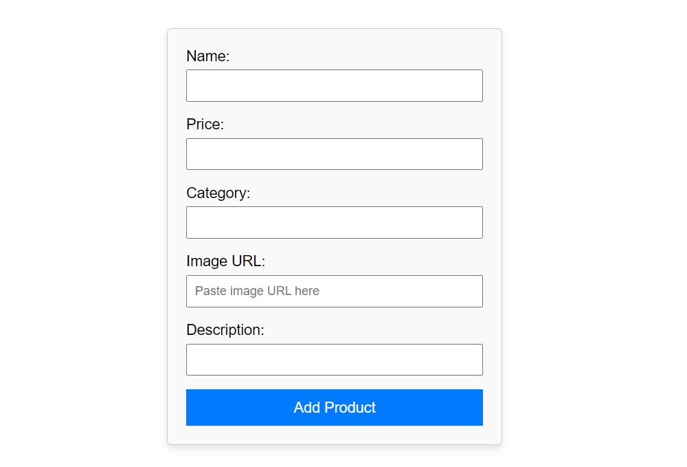
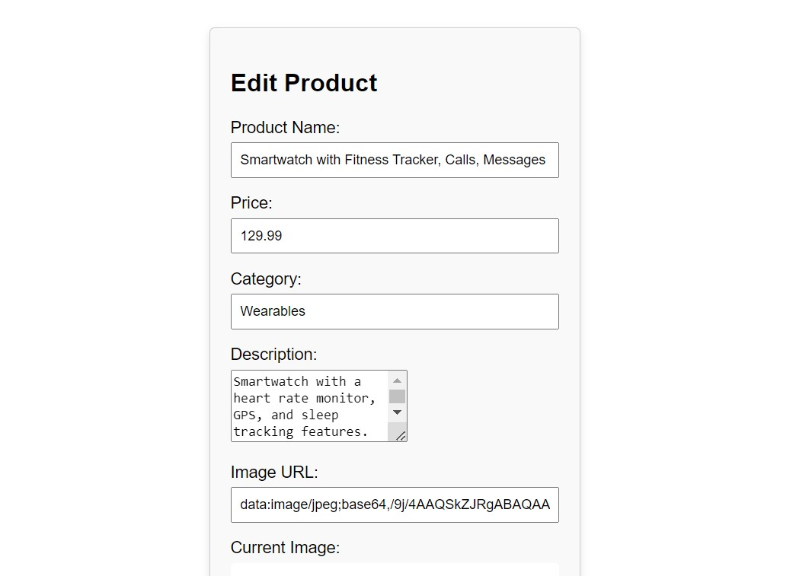

# **E-Commerce Web Application**
This is a comprehensive e-commerce web application featuring user authentication, product management, and is constructed using MongoDB, Express.js, Node.js, and other modern web technologies.
## **Project Overview**
The goal of this project is to develop a robust e-commerce platform that supports user registration, login, product management (add, edit, delete), and provides a responsive and intuitive user interface. This application is designed to be scalable and maintainable, using a combination of modern web technologies.
## **Features**
- **User Authentication**: Secure user registration and login with form validation.
- **Product Management**: Comprehensive product management including adding, editing, and deleting products.
- **Responsive Design**: Designed to be responsive, ensuring optimal viewing on various devices and screen sizes.
- **Session Management**: Secure session management to maintain user login state.
- **Error Handling**: Detailed error handling and user-friendly messages.
## **Technologies Used**
- **Backend**: Node.js, Express.js, MongoDB, Mongoose
- **Frontend**: HTML, CSS, EJS
- **Other Tools**: dotenv for environment variables, express-session for session management
## **Installation**
### **Prerequisites**
- Node.js and npm
- MongoDB instance (local or cloud-based like Atlas)
###
### **Setup Steps**
**Clone the Repository**

git clone https://github.com/yourusername/e-commerce-app.git

cd e-commerce-app

**Install Dependencies**
Run the following command to install the necessary npm packages:

npm install

**Configure Environment Variables**
Create a .env file in the root directory and add the following environment variables:

PORT=3000

MONGODB\_URI=your\_mongodb\_connection\_string

SESSION\_SECRET=your\_session\_secret

Replace your\_mongodb\_connection\_string with your actual MongoDB connection string and your\_session\_secret with a secure string.

**Start the Application**
Use the following command to start the application:

npm start

The application will be available at http://localhost:3000.
## **Usage**
### **Application Workflow**
1. **Home Page**
   1. View the list of products.
   1. Navigate to product details and add a new product.
1. **User Registration**
   1. Access the registration page at /losignup.
   1. Fill in the required details (name, email, password) and submit the form.
   1. Validate user input with client-side and server-side validation.

1. **User Login**
   1. Access the login page at /login.
   1. Enter your credentials (email/username and password) and log in.
   1. Handle authentication with sessions.
1. **Product Management**
   1. **Add Product**: Navigate to /add-product. Fill in the product details and submit the form.
   1. **Edit Product**: Click on a product from the list to edit its details. Update the information and save changes.
   1. **Delete Product**: Use the delete button next to each product to remove it from the inventory.

Sample Screenshots

**Dependencies**
- **Express.js**: Web framework for Node.js.
- **MongoDB**: NoSQL database.
- **Mongoose**: ODM library for MongoDB and Node.js.
- **EJS**: Templating engine for rendering HTML.
- **dotenv**: Module to load environment variables.
- **express-session**: Middleware for session management.

